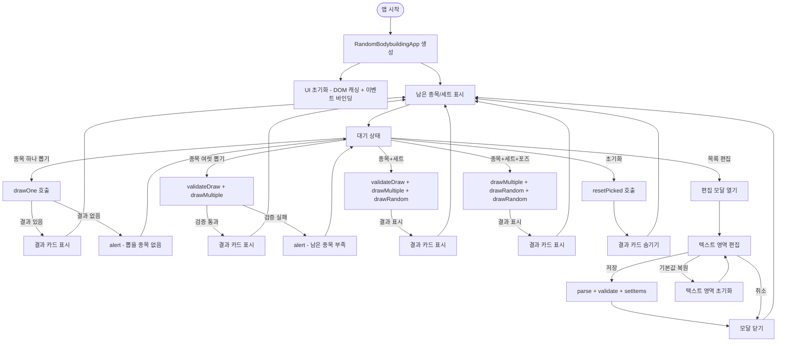
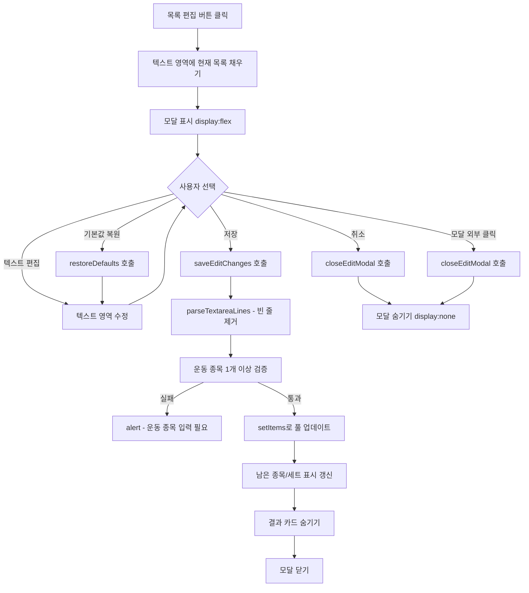
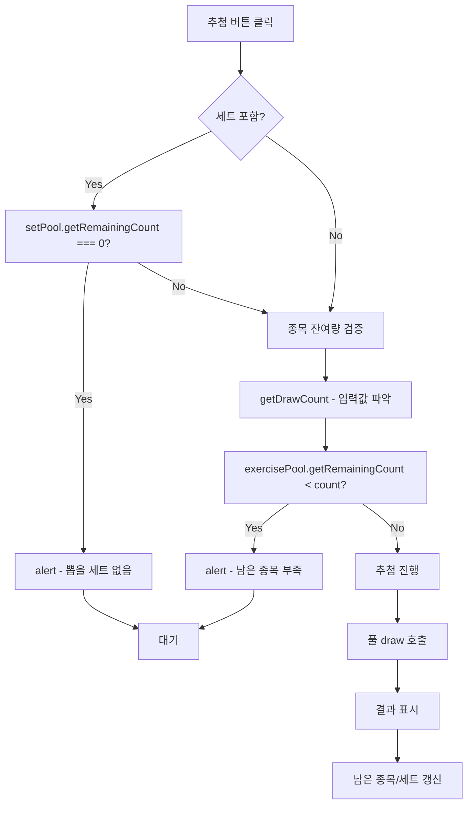
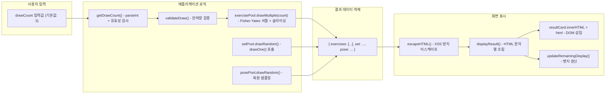
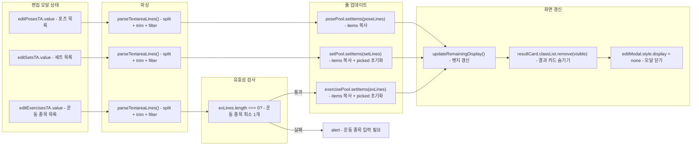
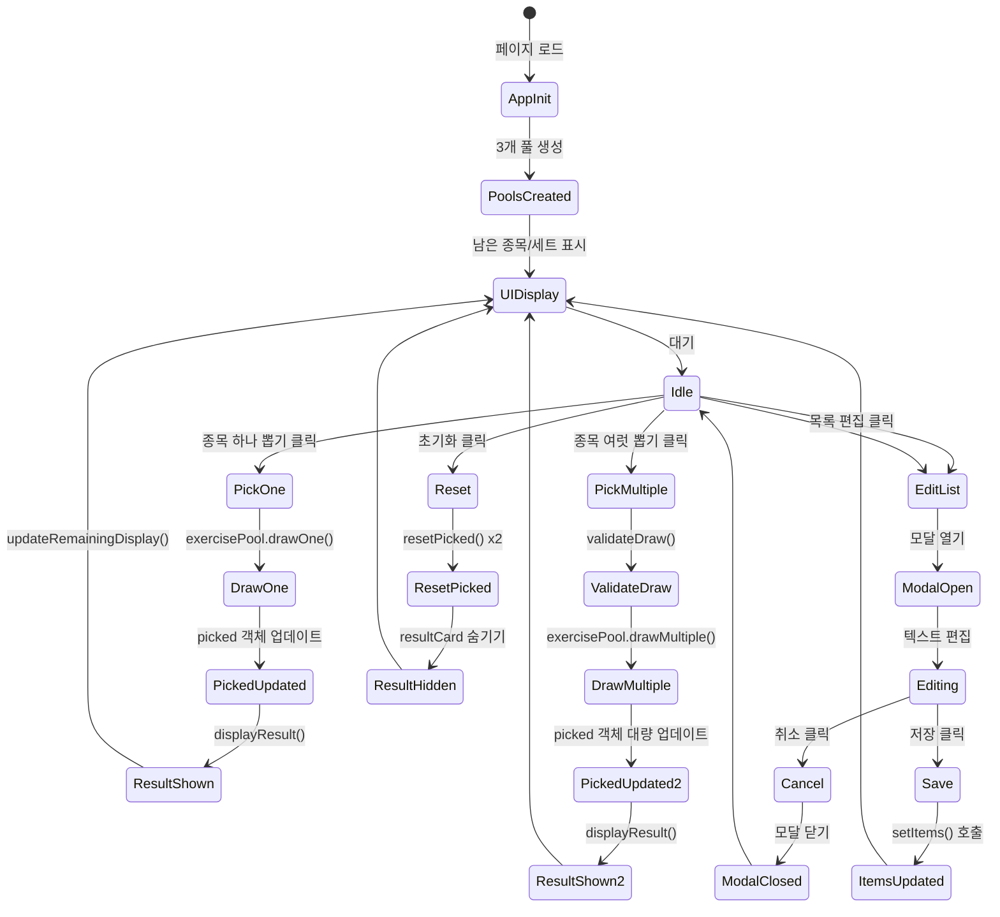

<!-- 애플리케이션 아키텍처 문서 - RandomBodyBuilding-web -->

# 애플리케이션 아키텍처

본 문서는 랜덤 보디빌딩 웹 애플리케이션의 기능 목록, 사용자 흐름, UI 구성 요소 및 데이터 흐름을 기술한다.

## 1. 기능 목록

### 1.1 핵심 기능

| 번호 | 기능명                  | 설명                                                     | 버튼 ID                  |
| ---- | ----------------------- | -------------------------------------------------------- | ------------------------ |
| 1    | 종목 하나 뽑기          | 저항운동 종목을 무작위로 하나 뽑아 표시                  | `btnPickOne`             |
| 2    | 종목 여럿 뽑기          | 저항운동 종목을 무작위로 N개 뽑아 표시 (N은 사용자 입력) | `btnPickMultiple`        |
| 3    | 종목 여럿 + 세트 하나   | 종목 N개와 세트 1개를 함께 뽑아 표시                     | `btnPickMultipleSet`     |
| 4    | 종목 여럿 + 세트 + 포즈 | 종목 N개, 세트 1개, 포즈 1개를 함께 뽑아 표시            | `btnPickMultipleSetPose` |
| 5    | 초기화                  | 뽑은 종목과 세트 기록을 초기화                           | `btnReset`               |
| 6    | 목록 편집               | 운동 종목, 세트, 포즈 목록을 편집                        | `btnEditList`            |

### 1.2 부가 기능

| 번호 | 기능명                  | 설명                             | 버튼 ID             |
| ---- | ----------------------- | -------------------------------- | ------------------- |
| 7    | 목록 기본값 복원 (운동) | 운동 종목 목록을 기본값으로 복원 | `resetExercises`    |
| 8    | 목록 기본값 복원 (세트) | 세트 목록을 기본값으로 복원      | `resetSets`         |
| 9    | 목록 기본값 복원 (포즈) | 포즈 목록을 기본값으로 복원      | `resetPoses`        |
| 10   | 편집 취소               | 편집 모달 닫기 (변경사항 버림)   | `cancelEdit`        |
| 11   | 편집 저장               | 편집된 목록을 저장하고 모달 닫기 | `saveEdit`          |
| 12   | 모달 외부 클릭 닫기     | 모달 배경 클릭 시 모달 닫기      | `editModal` (click) |

### 1.3 상태 표시 기능

| 번호 | 기능명         | 설명                                    | 요소 ID              |
| ---- | -------------- | --------------------------------------- | -------------------- |
| 13   | 남은 종목 표시 | 뽑을 수 있는 운동 종목의 남은 개수 표시 | `remainingCount`     |
| 14   | 남은 세트 표시 | 뽑을 수 있는 세트의 남은 개수 표시      | `remainingSetsCount` |
| 15   | 결과 카드      | 마지막 추첨 결과를 카드 형태로 표시     | `resultCard`         |

## 2. 사용자 흐름도

### 2.1 전체 사용자 흐름



### 2.2 목록 편집 흐름



### 2.3 추첨 검증 흐름



## 3. UI 구성 요소 레이아웃

### 3.1 UI 구조도

```mermaid
graph TD
    HTML["html lang=ko"] --> Head["head"]
    HTML --> Body["body"]

    Head --> MetaCharset["meta charset=UTF-8"]
    Head --> MetaViewport["meta viewport"]
    Head --> Title["title - 랜덤 보디빌딩"]
    Head --> LinkCSS["link stylesheet"]

    Body --> Container["div.container"]
    Body --> Script["script src=app.js"]

    Container --> TitleH1["h1 - 랜덤 보디빌딩"]
    Container --> RemainingDisplay["div#remainingDisplay"]
    Container --> RemainingSetsDisplay["div#remainingSetsDisplay"]
    Container --> CountInput["div.count-input-area"]
    Container --> ButtonGrid["div.button-grid"]
    Container --> ResultCard["div#resultCard"]

    RemainingDisplay --> RemainingCount["span#remainingCount"]
    RemainingSetsDisplay --> RemainingSetsCount["span#remainingSetsCount"]
    CountInput --> LabelCount["label - 뽑을 개수"]
    CountInput --> InputCount["input#drawCount value=3"]

    ButtonGrid --> ButtonRow1["div.button-row"]
    ButtonGrid --> ButtonRow2["div.button-row"]
    ButtonGrid --> ButtonRow3["div.button-row"]

    ButtonRow1 --> BtnPickOne["button#btnPickOne - 종목 하나 뽑기"]
    ButtonRow1 --> BtnPickMultiple["button#btnPickMultiple - 종목 여럿 뽑기"]
    ButtonRow2 --> BtnPickSet["button#btnPickMultipleSet - 종목+세트"]
    ButtonRow2 --> BtnPickPose["button#btnPickMultipleSetPose - 종목+세트+포즈"]
    ButtonRow3 --> BtnReset["button#btnReset - 초기화"]
    ButtonRow3 --> BtnEdit["button#btnEditList - 목록 편집"]

    Body --> EditModal["div#editModal.modal-overlay"]
    EditModal --> Modal["div.modal"]
    Modal --> ModalTitle["h2 - 목록 편집"]
    Modal --> EditSection1["div.edit-section"]
    Modal --> EditSection2["div.edit-section"]
    Modal --> EditSection3["div.edit-section"]
    Modal --> ModalActions["div.modal-actions"]

    EditSection1 --> LabelExercises["label - 저항운동 종목"]
    EditSection1 --> ResetExercises["button#resetExercises - 기본값 복원"]
    EditSection1 --> TextAreaExercises["textarea#editExercises"]

    EditSection2 --> LabelSets["label - 세트 목록"]
    EditSection2 --> ResetSets["button#resetSets - 기본값 복원"]
    EditSection2 --> TextAreaSets["textarea#editSets"]

    EditSection3 --> LabelPoses["label - 포징 모음 목록"]
    EditSection3 --> ResetPoses["button#resetPoses - 기본값 복원"]
    EditSection3 --> TextAreaPoses["textarea#editPoses"]

    ModalActions --> BtnCancel["button#cancelEdit - 취소"]
    ModalActions --> BtnSave["button#saveEdit - 저장"]
```



### 3.2 UI 컴포넌트 목록

| 컴포넌트         | HTML 요소  | 클래스/ID          | 설명                       |
| ---------------- | ---------- | ------------------ | -------------------------- |
| 메인 컨테이너    | `div`      | `container`        | 모든 UI 요소를 감싸는 루트 |
| 제목             | `h1`       | -                  | 랜덤 보디빌딩              |
| 남은 종목 배지   | `div`      | `remaining-badge`  | 남은 운동 종목 수 표시     |
| 남은 세트 배지   | `div`      | `remaining-badge`  | 남은 세트 수 표시          |
| 개수 입력 영역   | `div`      | `count-input-area` | 추첨 개수 입력             |
| 버튼 그리드      | `div`      | `button-grid`      | 버튼들을 감싸는 컨테이너   |
| 버튼 행          | `div`      | `button-row`       | 버튼들을 가로로 배치       |
| 결과 카드        | `div`      | `result-card`      | 추첨 결과 표시             |
| 결과 섹션        | `div`      | `result-section`   | 결과의 각 섹션             |
| 결과 라벨        | `div`      | `result-label`     | 섹션 제목                  |
| 운동 리스트      | `ul`       | `exercise-list`    | 운동 종목 목록             |
| 세트/포즈 아이템 | `div`      | `set-pose-item`    | 세트/포즈 표시             |
| 편집 모달        | `div`      | `modal-overlay`    | 모달 배경 오버레이         |
| 모달             | `div`      | `modal`            | 모달 본체                  |
| 편집 섹션        | `div`      | `edit-section`     | 각 편집 영역               |
| 텍스트 영역      | `textarea` | -                  | 목록 편집 입력             |
| 기본값 복원 버튼 | `button`   | `reset-small`      | 기본값으로 복원            |
| 모달 액션        | `div`      | `modal-actions`    | 취소/저장 버튼 영역        |

## 4. 데이터 흐름도

### 4.1 추첨 결과 데이터 흐름



### 4.2 목록 편집 데이터 흐름



### 4.3 상태 관리 데이터 흐름



## 5. 화면 레이아웃

### 5.1 데스크톱 레이아웃

```
+-----------------------------------------+
|  Random BodyBuilding                    |
|                                         |
|  +---------------+ +---------------+    |
|  | Remaining 52  | | Remaining 17|    |
|  +---------------+ +---------------+    |
|                                         |
|  Pick count [ 3 ]                       |
|                                         |
|  +-----------------+ +-----------------+ |
|  | Pick one        | | Pick multiple   | |
|  +-----------------+ +-----------------+ |
|                                         |
|  +-----------------+ +-----------------+ |
|  | Pick + set      | | Pick + set +pose| |
|  +-----------------+ +-----------------+ |
|                                         |
|  +-----------------+ +-----------------+ |
|  | Reset           | | Edit list       | |
|  +-----------------+ +-----------------+ |
|                                         |
|  +-------------------------------------+ |
|  | Result Card                         | |
|  |  Exercise 1                         | |
|  |  Exercise 2                         | |
|  |  Exercise 3                         | |
|  |  Set: Lower body triset             | |
|  |  Pose: Bodybuilding poses           | |
|  +-------------------------------------+ |
+-----------------------------------------+
```

### 5.2 모바일 레이아웃 (max-width: 400px)

- 컨테이너 패딩 축소
- 버튼 패딩 축소
- 버튼 폰트 크기 축소
- 버튼 최소 너비 축소

### 5.3 편집 모달 레이아웃

```
+-----------------------------------------+
|  [Background overlay - semi-transparent]|
|    +-----------------------------+      |
|    | Edit List                   |      |
|    |                             |      |
|    | Exercises     [Restore]     |      |
|    | +-------------------------+ |      |
|    | | Flat barbell bench press| |      |
|    | | ...                     | |      |
|    | +-------------------------+ |      |
|    |                             |      |
|    | Sets          [Restore]     |      |
|    | +-------------------------+ |      |
|    | | Lower body triset       | |      |
|    | | ...                     | |      |
|    | +-------------------------+ |      |
|    |                             |      |
|    | Poses         [Restore]     |      |
|    | +-------------------------+ |      |
|    | | Bodybuilding poses      | |      |
|    | | ...                     | |      |
|    | +-------------------------+ |      |
|    |                             |      |
|    | [ Cancel ] [ Save ]         |      |
|    +-----------------------------+      |
+-----------------------------------------+
```

## 6. 사용자 인터랙션 시나리오

### 6.1 시나리오 1: 운동 루틴 추첨

1. 사용자가 "종목 여럿 + 세트 + 포즈" 버튼을 클릭
2. 애플리케이션은 `validateDraw(true)`로 세트 잔여량과 종목 잔여량을 검증
3. `getDrawCount()`로 입력된 개수(기본값 3)를 읽어옴
4. `exercisePool.drawMultiple(3)`로 3개의 운동 종목을 무작위 추첨
5. `setPool.drawRandom()`로 1개의 세트를 무작위 추첨
6. `posePool.drawRandom()`로 1개의 포즈 모음을 무작위 추첨
7. `displayResult()`로 결과를 카드에 표시
8. `updateRemainingDisplay()`로 남은 종목/세트 수를 갱신

### 6.2 시나리오 2: 목록 커스터마이징

1. 사용자가 "목록 편집" 버튼을 클릭
2. 편집 모달이 열리며 각 텍스트 영역에 현재 목록이 채워짐
3. 사용자가 운동 종목 목록에서 항목을 추가/수정/삭제
4. "기본값 복원" 버튼을 눌러 기본 목록으로 되돌림
5. "저장" 버튼을 클릭하면 `parseTextareaLines()`로 파싱
6. 운동 종목이 1개 이상인지 검증
7. `setItems()`로 각 풀 업데이트
8. 모달 닫기 및 화면 갱신

### 6.3 시나리오 3: 전체 초기화

1. 사용자가 "초기화" 버튼을 클릭
2. `exercisePool.resetPicked()`와 `setPool.resetPicked()` 호출
3. `picked` 객체가 비워져 모든 종목과 세트가 다시 뽑힐 수 있음
4. 결과 카드가 숨겨짐
5. 남은 종목/세트 수가 최대값으로 표시
