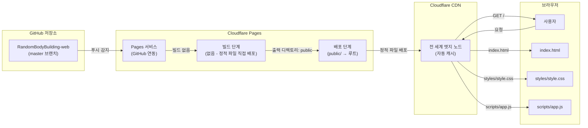
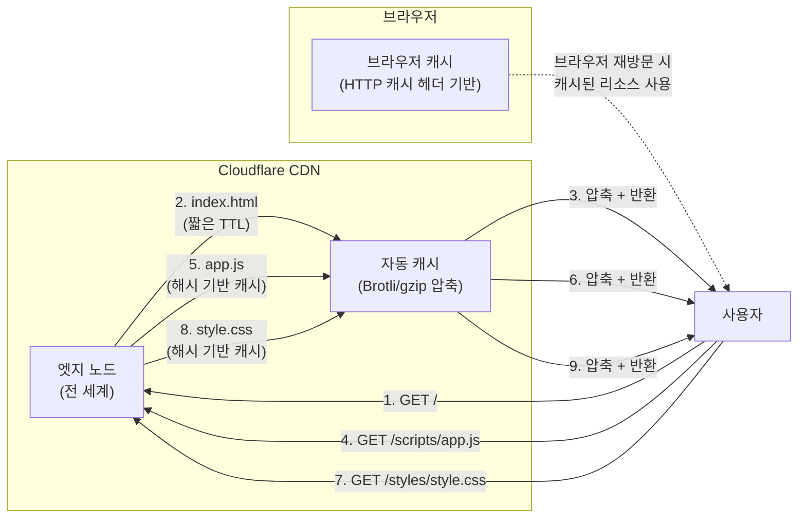
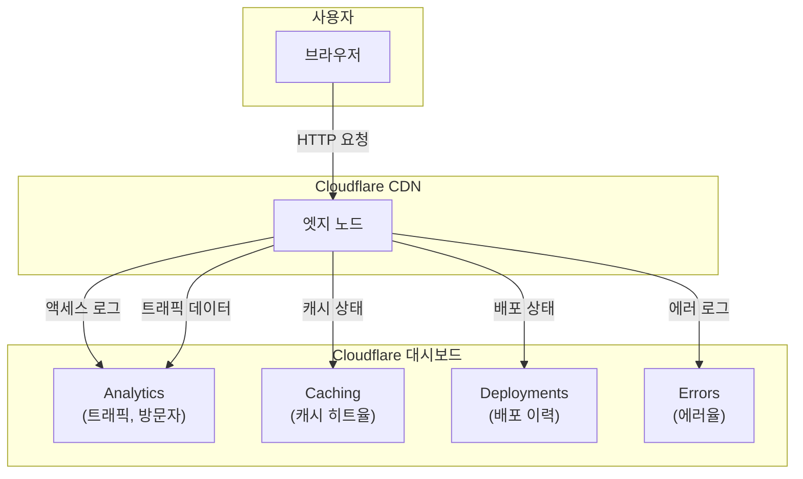

<!-- 배포 아키텍처 문서 - RandomBodyBuilding-web -->

# 배포 아키텍처

본 문서는 랜덤 보디빌딩 웹 애플리케이션의 배포 구조, 대상 파일, URL 구조, 캐시 전략 및 모니터링 방안을 기술한다.

## 1. 개요

랜덤 보디빌딩 웹은 **Cloudflare Pages**를 활용한 정적 웹 호스팅을 사용한다. 빌드 단계 없이 `public` 폴더의 정적 파일 (HTML, CSS, JS)을 그대로 CDN에 배포하며, GitHub 저장소와 연동하여 푸시 시 자동으로 배포가 이루어진다.

| 항목          | 값                           |
| ------------- | ---------------------------- |
| 호스팅 서비스 | Cloudflare Pages             |
| 배포 방식     | 정적 파일 호스팅 (빌드 없음) |
| 배포 루트     | `public/`                    |
| 빌드 도구     | 없음                         |
| 패키지 매니저 | 없음                         |
| 배포 트리거   | GitHub 푸시 (master 브랜치)  |

## 2. 배포 구조



### 배포 흐름

1. 개발자가 GitHub `master` 브랜치에 푸시
2. Cloudflare Pages가 푸시 이벤트를 감지
3. 빌드 명령 없이 `public/` 디렉토리를 그대로 출력 디렉토리로 사용
4. `public/` 내의 모든 정적 파일이 Cloudflare 전 세계 엣지 노드에 배포
5. 사용자의 요청은 가장 가까운 엣지 노드에서 처리

## 3. 배포 대상

| 파일         | 경로                | 역할                      |
| ------------ | ------------------- | ------------------------- |
| `index.html` | `/`                 | 메인 페이지 (HTML 마크업) |
| `app.js`     | `/scripts/app.js`   | 애플리케이션 로직 (JS)    |
| `style.css`  | `/styles/style.css` | 스타일시트 (CSS)          |

### 배포 파일 구조

```
public/
├── index.html          →  https://<domain>.pages.dev/
├── scripts/
│   └── app.js          →  https://<domain>.pages.dev/scripts/app.js
└── styles/
    └── style.css       →  https://<domain>.pages.dev/styles/style.css
```

## 4. 배포 설정

Cloudflare Pages 프로젝트 설정은 다음과 같다.

| 설정 항목          | 값       | 설명                              |
| ------------------ | -------- | --------------------------------- |
| 브랜치             | `master` | 배포가 트리거되는 브랜치          |
| 빌드 명령          | 없음     | 정적 파일이므로 빌드 단계 불필요  |
| 빌드 출력 디렉토리 | `public` | Cloudflare가 배포할 루트 디렉토리 |
| 빌드 간격          | 없음     | 푸시 시 즉시 배포                 |

> 참고: `package.json`이 존재하지 않으며, npm/yarn/pnpm을 사용하지 않는다. 빌드 도구 (Webpack, Vite, Babel 등)도 사용하지 않는다.

## 5. URL 구조

배포된 애플리케이션의 URL 구조는 다음과 같다.

| 리소스      | URL                                                | 설명                     |
| ----------- | -------------------------------------------------- | ------------------------ |
| 메인 페이지 | `https://<your-domain>.pages.dev/`                 | 랜덤 보디빌딩 메인 화면  |
| 앱 로직     | `https://<your-domain>.pages.dev/scripts/app.js`   | 브라우저에서 실행되는 JS |
| 스타일시트  | `https://<your-domain>.pages.dev/styles/style.css` | 페이지 스타일 정의       |

### 커스텀 도메인

Cloudflare에서 커스텀 도메인을 연결할 경우, 기본 `pages.dev` 도메인 외에 원하는 도메인으로도 접근할 수 있다.

| 타입                  | 도메인                             |
| --------------------- | ---------------------------------- |
| Cloudflare Pages 기본 | `https://<your-domain>.pages.dev/` |
| 커스텀 도메인 (선택)  | `https://your-domain.com/`         |

## 6. 캐시 전략

Cloudflare Pages는 자동으로 전 세계 CDN에 콘텐츠를 캐시한다. 각 파일 유형별 캐시 전략은 다음과 같다.

### 6.1 캐시 동작

| 파일 유형           | 캐시 전략            | 캐시 갱신 시점           |
| ------------------- | -------------------- | ------------------------ |
| HTML (`index.html`) | 짧은 캐시 (짧은 TTL) | 파일 변경 시 즉시 반영   |
| JS (`app.js`)       | 해시 기반 캐시       | 파일 내용 변경 시 무효화 |
| CSS (`style.css`)   | 해시 기반 캐시       | 파일 내용 변경 시 무효화 |

### 6.2 캐시 다이어그램



### 6.3 캐시 최적화 포인트

- **HTML**: 항상 최신 버전을 받도록 짧은 TTL을 유지한다. Cloudflare의 기본 설정을 따른다.
- **JS/CSS**: 파일 내용이 변경되면 자동으로 새 버전이 캐시된다. 파일명에 해시 값을 포함하는 방식으로 관리하면 더 정교한 캐시 무효화가 가능하다.
- **압축**: Cloudflare가 자동으로 Brotli 또는 gzip 압축을 적용한다. 별도 설정 불필요.

## 7. 모니터링

Cloudflare Pages 대시보드에서 다음 항목들을 모니터링할 수 있다.

### 7.1 확인 가능한 지표

| 항목      | 설명                                         | 확인 위치                         |
| --------- | -------------------------------------------- | --------------------------------- |
| 접근 로그 | 페이지 방문 기록 (IP, User-Agent, 응답 코드) | Cloudflare 대시보드 → Analytics   |
| 트래픽    | 요청 수, 전송량                              | Cloudflare 대시보드 → Analytics   |
| 캐시 상태 | 캐시 히트율 (Hit/Miss)                       | Cloudflare 대시보드 → Caching     |
| 에러율    | 4xx/5xx 응답 비율                            | Cloudflare 대시보드 → Analytics   |
| 배포 이력 | 배포 성공/실패 기록                          | Cloudflare 대시보드 → Deployments |

### 7.2 모니터링 다이어그램



### 7.3 운영 팁

- **배포 검증**: Cloudflare의 "Deploy previews" 기능을 사용하면 PR마다 미리 배포된 미리보기 URL을 생성할 수 있다.
- **실시간 알림**: 배포 실패 시 Cloudflare의 알림 기능 (웹훅, 이메일)으로 즉시 대응할 수 있다.
- **성능 모니터링**: Cloudflare의 "Speed" 탭에서 페이지 로드 성능과 Core Web Vitals을 확인할 수 있다.

<!-- EOF -->
