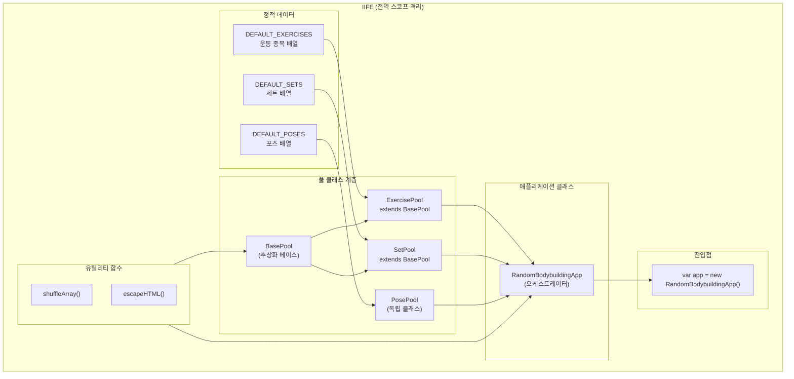
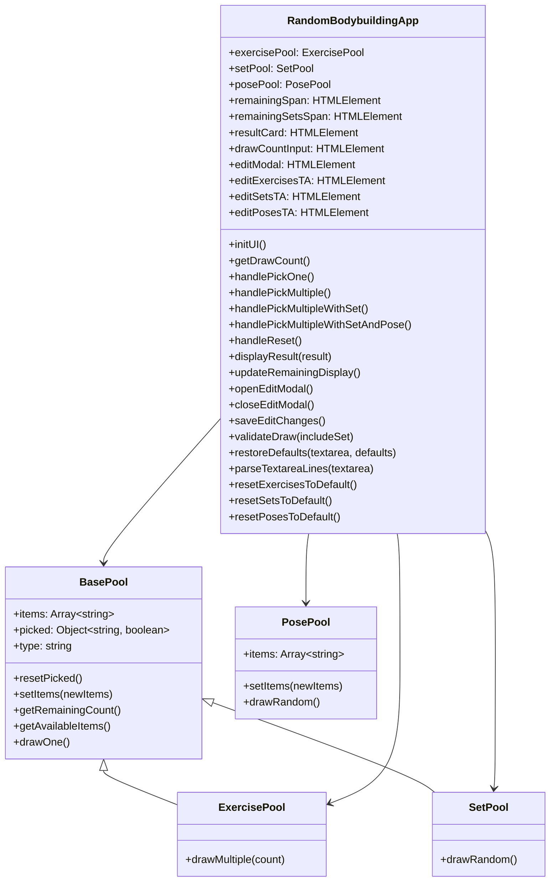
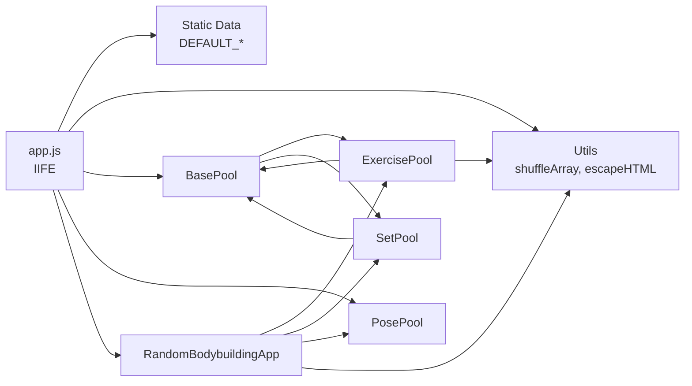

<!-- 소프트웨어 아키텍처 문서 - RandomBodyBuilding-web -->

# 소프트웨어 아키텍처

본 문서는 랜덤 보디빌딩 웹 애플리케이션의 모듈 구조, 사용된 디자인 패턴, 확장 지점 및 기술적 부채를 기술한다.

## 1. 모듈 구조

### 1.1 전체 모듈 구조도

애플리케이션은 단일 JS 파일 (`app.js`, 630줄)로 구성되며, IIFE로 감싸져 있어 전역 스코프를 오염시키지 않는다.



### 1.2 클래스 계층도



## 2. 디자인 패턴

### 2.1 IIFE 모듈 패턴 (Immediately Invoked Function Expression)

전체 애플리케이션은 IIFE로 래핑되어 있다. 이는 전역 스코프를 오염시키지 않으면서도 모든 코드가 같은 스코프 내에서 상호작용할 수 있게 한다.

```javascript
(function () {
    // 모든 변수와 함수는 이 스코프 내에서만 접근 가능
    var DEFAULT_EXERCISES = [...];
    var BasePool = function (items) { ... };
    var app = new RandomBodybuildingApp();
    window.__app = app;  // 의도적으로 전역 노출 (개발자 도구용)
})();
```

**장점**:
- 전역 변수 오염 방지
- 네임스페이스 충돌 회피
- 모든 내부 구현이 캡슐화됨

**단점**:
- 모듈 간 의존성 관리 어려움
- 테스트 코드 작성 어려움 (의존성 주입 불가)
- 파일 분리가 불가능 (단일 파일 구조)

### 2.2 프로토타입 기반 상속 (Prototype-based Inheritance)

ES6 `class` 문법 대신 프로토타입 기반 상속을 사용한다. `BasePool`을 상속하는 `ExercisePool`과 `SetPool`은 `Object.create()`로 프로토타입 체인을 설정한다.

```javascript
// 상속 설정 패턴
var ExercisePool = function (items) {
    BasePool.call(this, items);  // 부모 생성자 호출
    this.type = "exercise";
};

ExercisePool.prototype = Object.create(BasePool.prototype);
ExercisePool.prototype.constructor = ExercisePool;
```

**장점**:
- `class` 문법의 제약 없이 유연한 상속 구조
- 프로토타입 체인을 직접 제어 가능
- 낮은 브라우저 호환성 이슈

**단점**:
- 상속 설정 코드가 장황함
- `constructor` 재설정 필요
- 직관성이 떨어짐 (ES6 class 대비)

### 2.3 오케스트레이터 패턴 (Orchestrator Pattern)

`RandomBodybuildingApp`은 애플리케이션의 중앙 제어 객체로, 모든 풀을 생성하고 UI 이벤트를 연결하며 데이터 흐름을 조정한다.

```javascript
var RandomBodybuildingApp = function () {
    this.exercisePool = new ExercisePool(DEFAULT_EXERCISES);
    this.setPool = new SetPool(DEFAULT_SETS);
    this.posePool = new PosePool(DEFAULT_POSES);
    this.initUI();
    this.updateRemainingDisplay();
};
```

**장점**:
- 모든 로직이 한 곳에서 조정됨
- 풀 객체 간 결합도 낮춤 (각 풀은 독립적)
- UI와 비즈니스 로직 분리

**단점**:
- `RandomBodybuildingApp`이 거대해짐 (630줄 중 약 380줄)
- 단일 책임 원칙 위반 (생성, UI, 로직 모두 담당)

### 2.4 전략 패턴 (Strategy Pattern) - 추첨 전략

각 풀은 서로 다른 추첨 전략을 사용한다.

| 풀           | 전략                                | 설명                         |
| ------------ | ----------------------------------- | ---------------------------- |
| ExercisePool | `drawOne()` / `drawMultiple(count)` | 중복 추적 (복원 샘플링 아님) |
| SetPool      | `drawRandom()` → `drawOne()`        | 중복 추적 (복원 샘플링 아님) |
| PosePool     | `drawRandom()`                      | 복원 샘플링 (중복 허용)      |

### 2.5 팩토리 패턴 (Factory Pattern) - 결과 객체

`displayResult()`는 결과 객체를 받아 HTML 문자열로 변환하는 팩토리 역할을 한다.

```javascript
this.displayResult({ exercises: [exercise], set: null, pose: null });
```

## 3. 모듈 간 의존성

### 3.1 의존성 그래프



### 3.2 의존성 특징

- **순환 의존성 없음**: 모든 의존성이 단방향이다.
- **낮은 결합도**: 각 풀 클래스는 서로에 대해 알지 못한다.
- **높은 응집도**: `RandomBodybuildingApp`이 모든 풀을 조정한다.

## 4. 확장 지점 (Extension Points)

### 4.1 새로운 Pool 타입 추가

`BasePool`을 상속하여 새로운 풀 타입을 추가할 수 있다.

```javascript
// 예시: 새로운 EquipmentPool 추가
var EquipmentPool = function (items) {
    BasePool.call(this, items);
    this.type = "equipment";
};

EquipmentPool.prototype = Object.create(BasePool.prototype);
EquipmentPool.prototype.constructor = EquipmentPool;

// RandomBodybuildingApp에 추가
var RandomBodybuildingApp = function () {
    // ... 기존 코드
    this.equipmentPool = new EquipmentPool(DEFAULT_EQUIPMENTS);
};
```

**필요한 변경 사항**:
1. `DEFAULT_EQUIPMENTS` 상수 추가
2. `EquipmentPool` 클래스 정의
3. `RandomBodybuildingApp` 생성자에 풀 추가
4. `index.html`에 새 버튼 추가
5. `initUI()`에 이벤트 리스너 추가
6. `handlePickWithEquipment()` 핸들러 추가
7. `displayResult()`에 장비 표시 로직 추가

### 4.2 새로운 UI 버튼 추가

```javascript
// 1. index.html에 버튼 추가
// <button id="btnPickEquipment">📋➕장비</button>

// 2. initUI()에 이벤트 리스너 추가
document.getElementById("btnPickEquipment")
    .addEventListener("click", function () {
        self.handlePickWithEquipment();
    });

// 3. 핸들러 메서드 추가
RandomBodybuildingApp.prototype.handlePickWithEquipment = function () {
    if (!this.validateDraw(true)) return;
    var count = this.getDrawCount();
    var exercises = this.exercisePool.drawMultiple(count);
    var equipment = this.equipmentPool.drawRandom();
    this.displayResult({ exercises: exercises, set: null, pose: null, equipment: equipment });
    this.updateRemainingDisplay();
};
```

### 4.3 새로운 결과 표시 섹션 추가

`displayResult()`에 새로운 섹션을 추가할 수 있다.

```javascript
if (equipment) {
    html += '<div class="result-section">' +
            '<div class="result-label">🏋️ 장비</div>' +
            '<div class="set-pose-item">🔧 ' + escapeHTML(equipment) + '</div>' +
            '</div>';
}
```

## 5. 기술적 부채 (Technical Debt)

### 5.1 단일 파일 구조

**문제**: 모든 코드가 `app.js`라는 단일 파일에 존재한다 (630줄).

| 항목      | 값      |
| --------- | ------- |
| 파일 크기 | 630줄   |
| 클래스 수 | 5개     |
| 메서드 수 | 약 30개 |
| 함수 수   | 약 10개 |

**영향**:
- 가독성 저하 (스크롤이 길어짐)
- 유지보수 어려움 (찾기 힘든 코드)
- 병렬 개발 어려움 (같은 파일에 충돌)
- 코드 재사용 어려움 (모듈 분리 불가)

**해결 방향**: ES 모듈로 분리 (하지만 프로젝트 규칙에 따라 ES 모듈 미사용)

### 5.2 테스트 코드 부재

**문제**: 테스트 코드가 전혀 존재하지 않는다.

```bash
# 테스트 파일이 없음
$ find . -name "*.test.js" -o -name "*.spec.js"
# (결과 없음)
```

**영향**:
- 리팩토링 시 회귀 버그 위험
- 코드 신뢰도 저하
- 새 기능 추가 시 검증 어려움

**해결 방향**: Jest나 Vitest 같은 테스트 프레임워크 도입 (하지만 npm 미사용 프로젝트)

### 5.3 ES 모듈 미사용

**문제**: `import`/`export` 문법을 사용하지 않고 IIFE로 모든 것을 감싼다.

**영향**:
- 모듈 간 의존성 명시적 관리 불가
- 트리 쉐이킹 불가
- 빌드 도구와의 연동 어려움
- 코드 분할 불가

**해결 방향**: `<script type="module">` 사용 (브라우저 지원 범위 축소 가능)

### 5.4 var 키워드 사용

**문제**: `const`와 `let` 대신 `var`만 사용한다.

```javascript
var shuffleArray = function (arr) { ... };  // var 사용
var self = this;  // var 사용
```

**영향**:
- 블록 스코프 없음 (의도치 않은 변수 승격)
- 재할당 가능 (불변성 침해)
- 모던 JS 생태계와의 간극

**해결 방향**: 프로젝트 규칙에 따라 유지 (var 키워드 강제)

### 5.5 프로토타입 상속의 장황함

**문제**: ES6 class 대신 프로토타입 상속을 사용하여 상속 설정 코드가 장황하다.

```javascript
ExercisePool.prototype = Object.create(BasePool.prototype);
ExercisePool.prototype.constructor = ExercisePool;
```

**영향**:
- 상속 설정 2줄 필요
- `constructor` 재설정 빼먹을 수 있음
- 직관성 저하

### 5.6 DOM 캐싱의 한계

**문제**: `initUI()`에서 DOM 요소를 캐싱하지만, 새 요소가 동적으로 추가될 경우 참조가 끊길 수 있다.

```javascript
this.remainingSpan = document.getElementById("remainingCount");
```

**영향**:
- 동적 콘텐츠 추가 시 새로운 요소 참조 필요
- 메모리 누수 가능성 (참조 유지)

## 6. 코드 스타일

### 6.1 프로젝트 규칙

| 규칙               | 적용 | 설명                    |
| ------------------ | ---- | ----------------------- |
| `var` 키워드       | ✅    | `const`/`let` 대신 사용 |
| `class` 문법       | ✅    | 프로토타입 사용         |
| 풀잇글             | ✅    | 파일 시작에 구실 설명   |
| HTML/JS/CSS 대문자 | ✅    | 낱말 전체 대문자        |
| 순환 임포트        | ✅    | 없음 (단일 파일)        |
| 지연 임포트        | ✅    | 없음 (단일 파일)        |

### 6.2 네이밍 컨벤션

| 유형      | 컨벤션           | 예시                         |
| --------- | ---------------- | ---------------------------- |
| 변수/함수 | camelCase        | `shuffleArray`, `escapeHTML` |
| 클래스    | PascalCase       | `BasePool`, `ExercisePool`   |
| 상수      | UPPER_SNAKE_CASE | `DEFAULT_EXERCISES`          |
| 프로퍼티  | camelCase        | `items`, `picked`, `type`    |

### 6.3 주석 스타일

- **파일 상단**: 풀잇글 (파일의 구실 설명)
- **클래스/생성자**: `/** */` 블록 주석
- **메서드**: `/** */` 블록 주석
- **섹션 구분**: `// ---` 스타일
- **인라인**: `//` 스타일

## 7. 향후 개선 가능 영역

| 영역        | 현재 상태 | 개선 방향                      |
| ----------- | --------- | ------------------------------ |
| 모듈화      | 단일 파일 | ES 모듈로 분리                 |
| 테스트      | 없음      | 테스트 프레임워크 도입         |
| 타입 안정성 | 없음      | TypeScript 도입                |
| 빌드        | 없음      | 빌드 도구 도입                 |
| 상태 관리   | 메모리    | 상태 관리 라이브러리           |
| 스타일링    | CSS 변수  | CSS-in-JS 또는 스타일 컴포넌트 |
