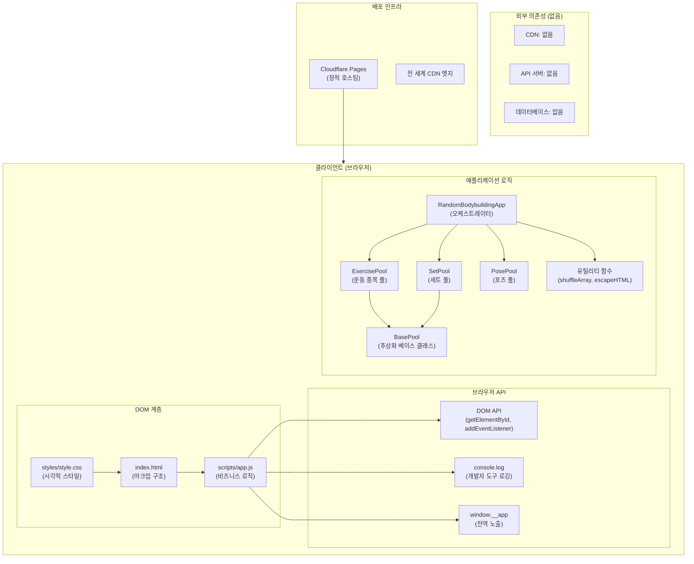
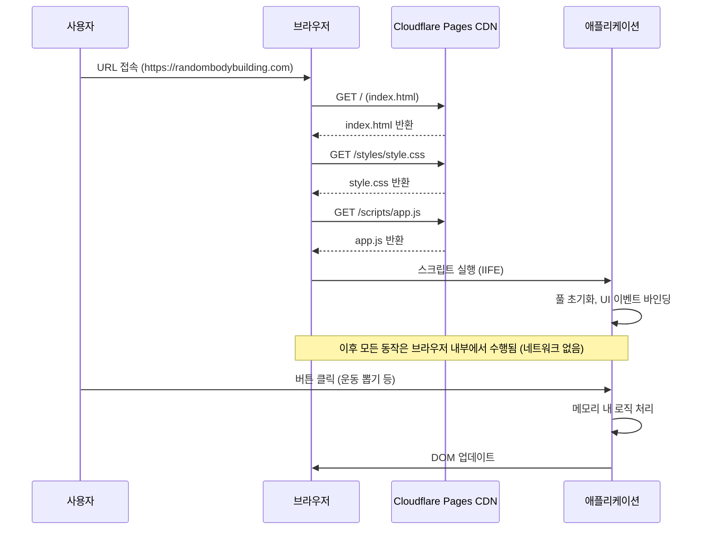

<!-- 시스템 아키텍처 문서 - RandomBodyBuilding-web -->

# 시스템 아키텍처

본 문서는 랜덤 보디빌딩 웹 애플리케이션의 시스템 구성, 구성 요소, 외부 의존성, 통신 방식 및 보안 설계를 기술한다.

## 1. 시스템 개요

랜덤 보디빌딩 웹은 **클라이언트 단독 정적 웹 사이트**이다. 서버 사이드 로직, 데이터베이스, 백엔드 API가 전혀 존재하지 않으며, 브라우저에서 모든 동작이 수행된다. Cloudflare Pages를 통해 `public` 폴더의 정적 파일들이 CDN에 배포되며, 사용자는 이를 브라우저에서 직접 로드하여 사용한다.

## 2. 시스템 구성 요소

### 2.1 클라이언트 측 구성 요소

| 구성 요소         | 파일               | 설명                                      |
| ----------------- | ------------------ | ----------------------------------------- |
| HTML 마크업       | `index.html`       | 페이지 구조 및 UI 요소 정의               |
| 스타일시트        | `styles/style.css` | 시각적 스타일링 (CSS 변수 기반 초록 테마) |
| 애플리케이션 로직 | `scripts/app.js`   | 모든 비즈니스 로직 (630줄, IIFE 래핑)     |

### 2.2 시스템 다이어그램



## 3. 시스템 구성 요소 상세

### 3.1 index.html

- **역할**: 페이지의 뼈대가 되는 HTML 마크업을 정의한다.
- **특징**:
  - `<!doctype html>`로 HTML5 문서 타입 선언
  - `lang="ko"`로 언어 속성 설정 (한국어)
  - `viewport-fit=cover`로 모바일 안전 영역 처리
  - 핀치줌 비활성화 (`maximum-scale=1.0`)
  - CSS는 `<link>` 태그로 외부 파일 참조
  - JS는 `<script src="scripts/app.js">`로 하단에 로드 (렌더링 블로킹 방지)

### 3.2 styles/style.css

- **역할**: 애플리케이션의 모든 시각적 스타일을 정의한다.
- **특징**:
  - CSS 변수 기반 색상 체계 (초록 계열 테마)
  - 반응형 디자인 (`@media (max-width: 400px)`)
  - 카드형 레이아웃 (`max-width: 520px`)
  - 모바일 우선 설계 (안드로이드, iOS 지원)
  - `backdrop-filter: blur(4px)`로 모달 오버레이 효과

### 3.3 scripts/app.js

- **역할**: 애플리케이션의 모든 비즈니스 로직을 담당한다.
- **특징**:
  - IIFE (Immediately Invoked Function Expression)로 전역 스코프 격리
  - `var` 키워드 전용 (const/let 미사용)
  - 프로토타입 기반 OOP (class 문법 미사용)
  - 5개의 클래스: BasePool, ExercisePool, SetPool, PosePool, RandomBodybuildingApp
  - `window.__app`으로 전역 노출 (개발자 도구 접근용)

## 4. 외부 의존성

### 4.1 의존성 없음

이 애플리케이션은 **완전한 제로 의존성**을 유지한다.

| 의존성 유형    | 존재 여부 | 설명                                               |
| -------------- | --------- | -------------------------------------------------- |
| CDN 라이브러리 | 없음      | jQuery, Bootstrap 등 외부 CSS/JS 라이브러리 미사용 |
| API 서버       | 없음      | 백엔드 API 호출 없음 (fetch, axios 미사용)         |
| 데이터베이스   | 없음      | DB 연결 없음 (localStorage, IndexedDB 미사용)      |
| 빌드 도구      | 없음      | Webpack, Vite, Babel 등 빌드 도구 미사용           |
| 패키지 매니저  | 없음      | npm, yarn, pnpm 미사용 (package.json 없음)         |
| 프레임워크     | 없음      | React, Vue, Angular 미사용                         |

### 4.2 브라우저 API 의존성

애플리케이션은 다음 브라우저 내장 API만을 사용한다.

| API                        | 사용처                           |
| -------------------------- | -------------------------------- |
| `document.getElementById`  | DOM 요소 조회                    |
| `addEventListener`         | 이벤트 리스너 등록               |
| `Math.random`              | 무작위 추첨                      |
| `console.log`              | 개발자 도구 로깅                 |
| `window`                   | 전역 객체 (앱 인스턴스 노출)     |
| `alert`                    | 사용자 알림                      |
| `Array.prototype.slice`    | 배열 복사                        |
| `Array.prototype.filter`   | 배열 필터링                      |
| `Array.prototype.forEach`  | 배열 순회                        |
| `Array.prototype.join`     | 문자열 연결                      |
| `String.prototype.replace` | 문자열 치환 (escapeHTML)         |
| `String.prototype.split`   | 문자열 분할 (parseTextareaLines) |
| `String.prototype.trim`    | 문자열 공백 제거                 |
| `parseInt`                 | 숫자 파싂 (getDrawCount)         |

## 5. 통신 (Communication)

### 5.1 오프라인 동작

애플리케이션의 모든 기능은 **완전한 오프라인 환경**에서 동작한다.

| 기능           | 오프라인 동작                |
| -------------- | ---------------------------- |
| 운동 종목 추첨 | 가능 (메모리 기반 무작위)    |
| 세트 추첨      | 가능 (메모리 기반 무작위)    |
| 포즈 추첨      | 가능 (메모리 기반 무작위)    |
| 목록 편집      | 가능 (메모리 내 수정)        |
| 초기화         | 가능 (메모리 내 상태 재설정) |

### 5.2 네트워크 의존성

- **초기 로드**: 정적 파일 (HTML, CSS, JS)을 브라우저가 다운로드하는 유일한 네트워크 요청
- **런타임**: 페이지가 로드된 이후 **어떠한 네트워크 요청도 발생하지 않는다**
- **에러 처리**: 네트워크 실패 시 에러 처리 코드가 없으며, 파일이 제대로 로드되지 않으면 애플리케이션이 동작하지 않는다

### 5.3 통신 다이어그램



## 6. 보안 (Security)

### 6.1 XSS 방지

애플리케이션은 사용자 입력을 화면에 표시할 때 반드시 `escapeHTML()` 함수로 이스케이프 처리한다.

```javascript
var escapeHTML = function (str) {
    return String(str)
        .replace(/&/g, "&amp;")
        .replace(/</g, "&lt;")
        .replace(/>/g, "&gt;")
        .replace(/"/g, "&quot;")
        .replace(/'/g, "&#039;");
};
```

**적용 위치**: `displayResult()` 메서드에서 모든 사용자 입력 (운동명, 세트명, 포즈명)이 `escapeHTML()`로 처리된 후 DOM에 삽입된다.

```javascript
html += "<li>✅ " + escapeHTML(ex) + "</li>";
```

### 6.2 CSP (Content Security Policy)

현재 애플리케이션은 CSP 메타 태그를 설정하지 않고 있다. 향후 보안 강화를 위해서는 다음과 같은 CSP 헤더를 추가하는 것이 권장된다.

```html
<meta http-equiv="Content-Security-Policy"
      content="default-src 'self';
               style-src 'self' 'unsafe-inline';
               script-src 'self';
               img-src 'self' data:;">
```

### 6.3 공격 표면

| 공격 유형  | 취약 여부 | 설명                              |
| ---------- | --------- | --------------------------------- |
| XSS        | 방어됨    | escapeHTML로 모든 출력 이스케이프 |
| CSRF       | 해당 없음 | 서버 요청 없음                    |
| SQL 인젝션 | 해당 없음 | 데이터베이스 없음                 |
| 클릭잭킹   | 취약      | frame 내장 방지 메타 태그 없음    |
| 정보 유출  | 최소화    | 개인 정보 수집 없음               |

## 7. 성능 특성

### 7.1 페이지 로드 성능

- **파일 크기**: HTML (~3KB), CSS (~8KB), JS (~18KB) - 총합 약 30KB
- **요청 수**: 3개 (HTML, CSS, JS)
- **렌더링**: JS가 하단에 배치되어 있어 CSS 파싱과 병렬로 진행
- **압축**: Cloudflare 자동 압축 (gzip/Brotli)

### 7.2 런타임 성능

- **메모리 사용량**: 최소 (52개 운동, 17개 세트, 7개 포즈의 문자열 배열)
- **연산 복잡도**: Fisher-Yates 셔플 O(n), 필터링 O(n)
- **DOM 조작**: 최소한의 조작 (resultCard.innerHTML 한 번의 삽입)

## 8. 호환성

### 8.1 지원 브라우저

| 브라우저         | 지원 여부         |
| ---------------- | ----------------- |
| Chrome           | 지원              |
| Safari           | 지원 (iOS 9 이상) |
| Firefox          | 지원              |
| Edge             | 지원              |
| Samsung Internet | 지원              |

### 8.2 모바일 최적화

- `viewport-fit=cover`로 iPhone 동적 스탠드(노치) 지원
- `@media (max-width: 400px)` 반응형 레이아웃
- 터치 친화적인 버튼 크기 (`min-width: 130px`)
- `user-scalable=yes`로 접근성 유지 (확대 축소 가능)
